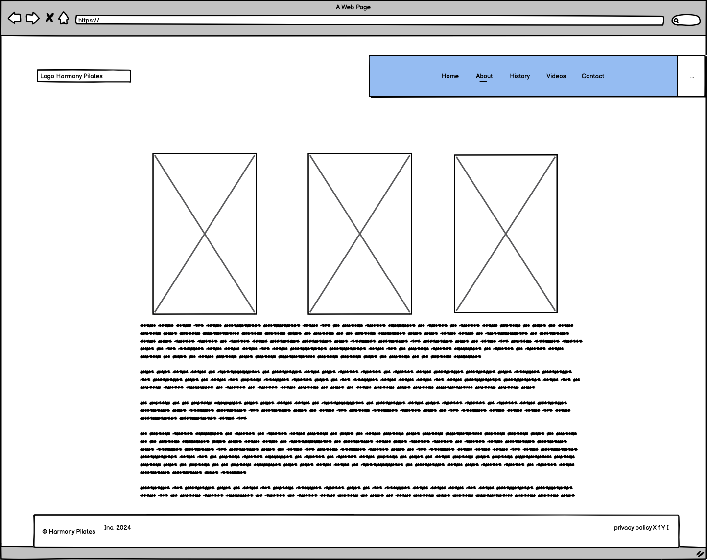
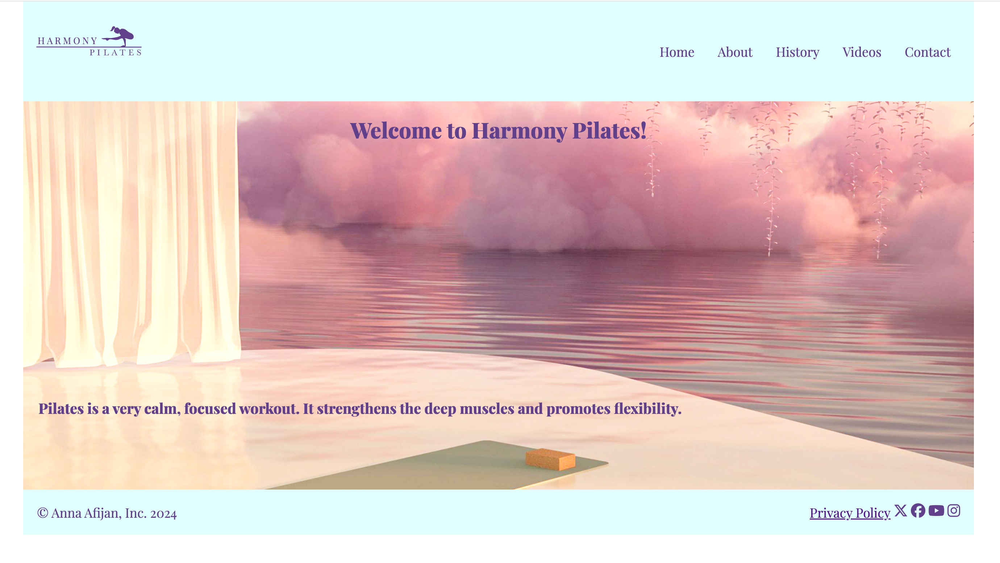
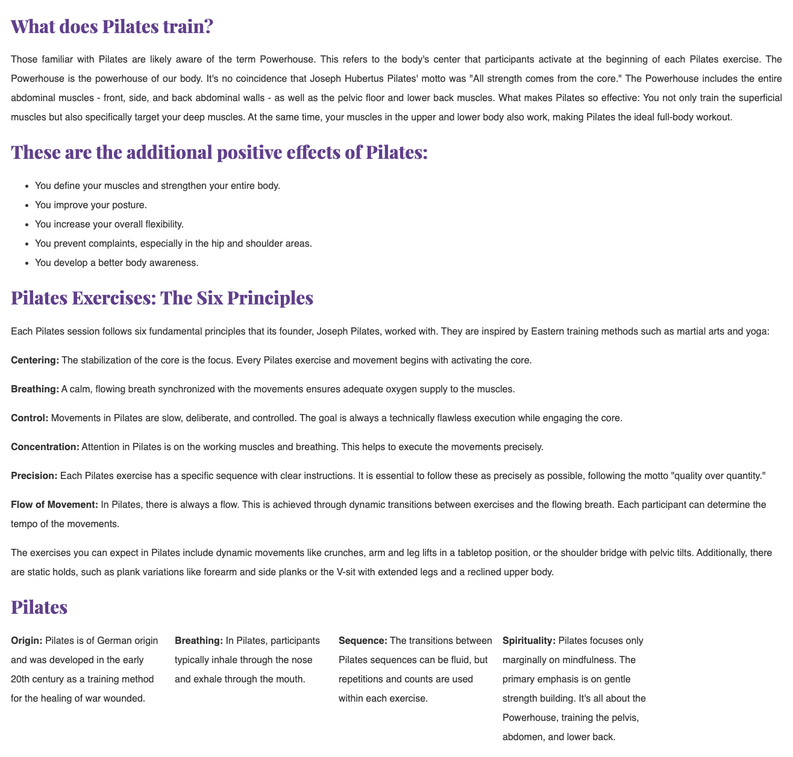
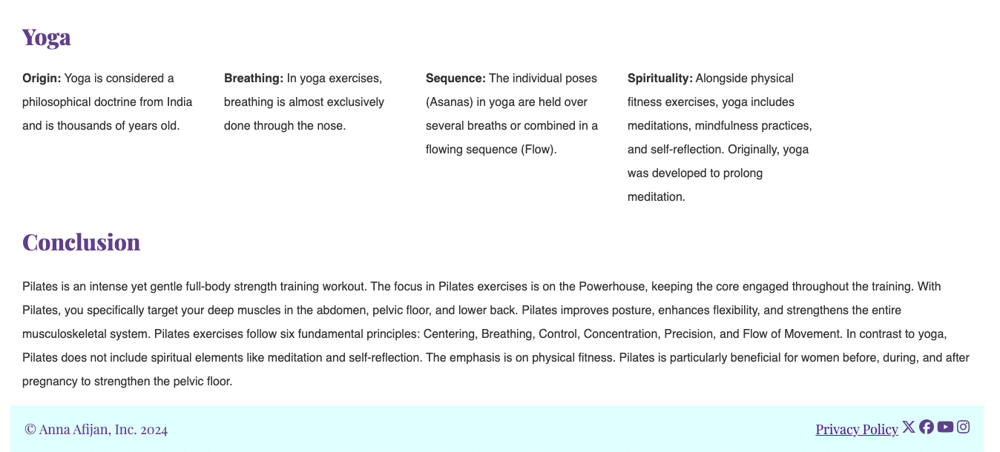
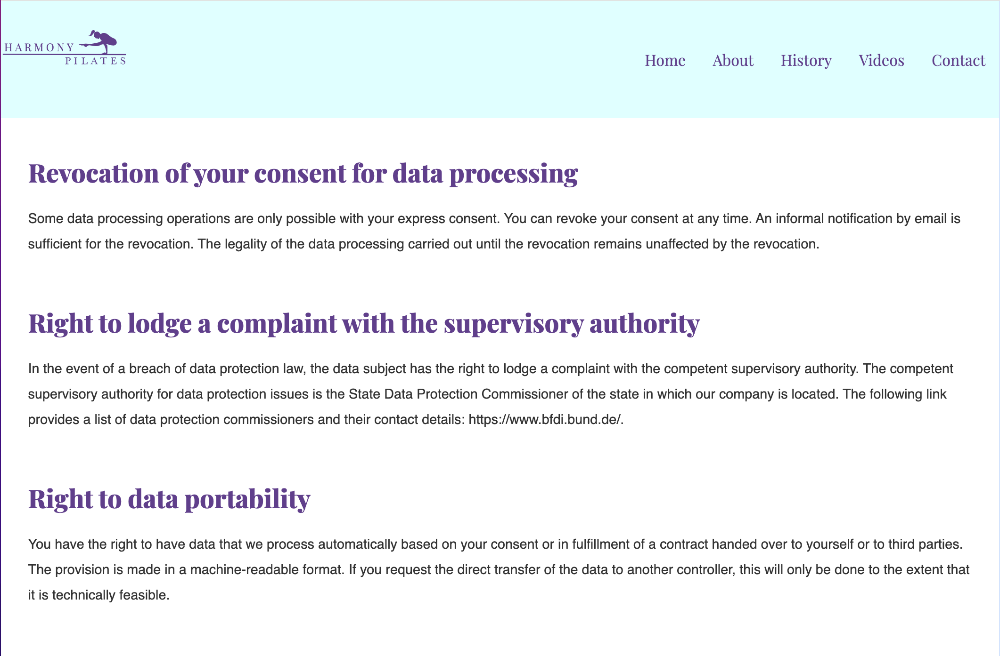

# pilates-website
The project "Harmony-Pilates" aims to promote an active lifestyle, particularly targeting individuals who work from home and spend prolonged periods sitting. Pilates, a form of exercise that involves controlled movements, not only strengthens muscles but also provides effective body stretching and enhances mental stability. It emphasizes the significance of movement in leading a fulfilling life. With this website, my intention is to raise awareness and understanding of pilates among people. By exploring the website, users will gain insights into the importance of balance and vitality in their lives.

Visit the deployed website here → [Harmony Pilates Website](https://github.com/Ann-Anahit/pilates-website)

## Content

* [User Experience](#user-experience-ux)
    * [User Stories](#user-stories)
* [Design](#design)
    * [Website Structure](#website-structure)
    * [Wireframes](#wireframes)
    * [Colors I used]
    * [Typography](#typography)
* [Features and Future Features](#features-and-future-features)
    * [Features](#features)
    * [Future Features](#future-features)
* [Technologies Used](#technologies-used)
* [Deployment, Fork and Clone](#deployment-fork-and-clone)
    * [Deployment](#deployment)
    * [Fork](#how-to-fork)
    * [Clone](#how-to-clone)
* [Testing](#testing)
* [Bugs](#bugs)
    * [Known Bugs](#known-bugs)
* [Credits](#credits)
* [Content](#content)
* [Media](#media)
* [Acknowledgments](#acknowledgments)

## User Experience (UX)

### User Stories

#### First Time User

* I want to know about Pilates.
* I want the website to be responsive on my device.
* I want the information to be easy to find.
* I want the website to be easy to navigate

#### Frequent User
* I want to start with pilates.

## Design

### Website Structure

The website consists of a 7-page website, with 5 pages navigable via the navigation bar and the seventh being a customized page to inform the user that the content of the form has been submitted. The home page is the default loading page. The logo is in the top left corner and the menu is in the top right corner. This navigation bar on small screen devices ends up centralizing the three elements and the menu becomes a dropdown menu.

### Wireframes

I create the wireframes with the Balsamiq Wireframes.

Wireframes

  
home page 

  
about page 

  
history page 

  
videos page 

  
contact page 

  

### Color Scheme

- I used the color `#603F8B` in the navigation bar, for my logo and the icons in the bottom. 
- As secondary color I used `#FCD8C5` in the navigation bar.
- At the bottom is a padding in this `#E0FFFF` color.
- As text color I used `333333`.

### Typography

The font I chose to use is [playfair-display](https://gwfh.mranftl.com/fonts/playfair-display?subsets=latin) from Google Fonts and as a fall back font, sans-serif.

This website includes 7 pages and all of them are responsive. They are: Home, About, History, Videos, Contact, Form Submitted und privacy policy. On each page we have:

- A favicon. 

- A navigation bar 

### The Home Page

On the home page the user will find the message **Welcome to our pilates website** which clearly gives the idea of what the website is about.Also the background picture shows a person doing pilates.
 

### The About Page

This page comprises three images of a person who shows some pilates poses, under the images is a text what about pilates is.
 
 
 

### The History Page

On this page is a text about the history of pilates. The text is between two picturs.

### Video Page

Here the user will find two videos of a person who is doing pilates in the nature.

### Contact Page

There is a contact form and two figures on the bottom of the page.

### Form Submitted Page

This custom page was created to show up after a form is submitted, whether it's a contact form. The user cannot access it from the navigation bar.

### The Privacy Policy Page

On this page is a text about the privacy policy of the page. 

[Back to top](<#content>)

## Technologies and Sides Used

- HTML5 to create the website structure.
- CSS3 to style the website.
- [Git](https://git-scm.com/) for version control.
- [GitHub](https://github.com/) to store files for the website.
- [Balsamiq Wireframes](https://www.balsamiq.com/) to create the wireframes.
- [Chat GPT](https://chat.openai.com/) to generate texts about the  history of pilates.
- [Google Fonts](https://fonts.google.com/) to import the font used on the website.
- [Favicon.io](https://favicon.io/) to create favicon.
- [Am I Responsive?](https://ui.dev/amiresponsive) to display the website image across various devices.
- [Unsplash](https://unsplash.com/de) and [Vecteezy]https://de.vecteezy.com/ to get images.
- [pixabay]https://pixabay.com/de/videos/ to get videos.

[Back to top](<#content>)

## Deployment, Fork and Clone

### Deployment

1. Log in to GitHub.
2. Go to the repository for the project.
3. Click the settings button.
4. Select **Pages** in the left navigation menu under Code and Automation.
5. From the source dropdown select main branch and root. Press the save button.
6. The site has been deployed. It may take a few minutes before the site goes live.

### How to Fork

1. Log in to GitHub.
2. Go to the repository for the project.
3. Click the Fork button in the top right corner.

### How to Clone

1. Log in to GitHub.
2. Go to the repository for the project.
3. Click on the **green code button** and select if you would like to clone with HTTPS, SSH or GitHub CLI and copy the link below.
4. Navigate to the directory where you want to clone the repository and open terminal.
5. Type *git clone* into the terminal and paste the link you have from number 3. Press enter. This command will download the entire repository to your local machine.

[Back to top](<#content>)

