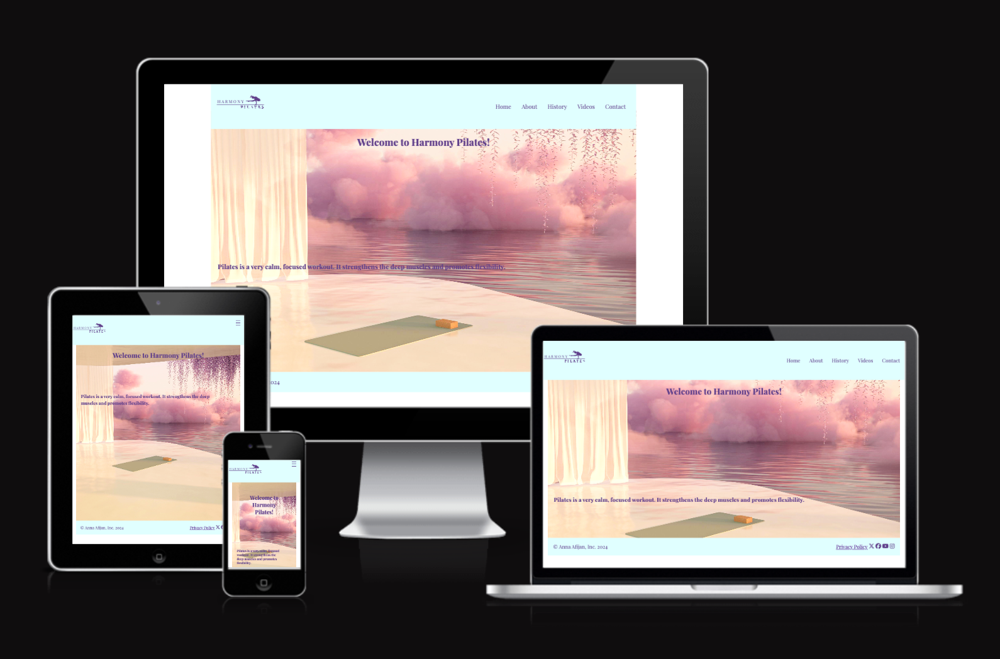

# Harmony Pilates - Testing

Visit the deployed website here → [Harmony Pilates](https://ann-anahit.github.io/pilates-website/)

## Content

* [Manual Testing](#manual-testing)
    * [Browser Testing](#browser-testing)
* [Automated Testing](#automated-testing)
    * [W3C Validator](#w3c-validator)
    * [CSS Validator](#css-validator)
    * [Lighthouse](#lighthouse)

## Manual Testing

I tested all the buttons and links throughout the creation of the website and did a final test. The result of the final test is below.

| Feature | Expectation | Action | Result |
| :--- | :--- | :--- | :--- |
| Navigation bar buttons | Takes the user to the respective page. | Clicked button. | Respective page loads. |
| Stylized buttons | Change color when the mouse hovers over them.| Hovered mouse over buttons. | The color changes. |
| Send message button | Submit forms. | Clicked button. | Submit form. |
| Send form without white space | Form cannot be sent with white spaces. | Tested submitting with white space on each label. | The form is not sent. |
| Form submitted page | Show up a page informing the user that the form has been submitted successfully. | Submitted a form. | The page showed up. |
| Social media links | Social media links should open externally. | Clicked on social media icons at the bottom of the page. | The links open externally. |

### Browser Testing

I tested the website in different browsers, both on computer and mobile.

| Browser | Result |
| :--- | :--- |
| Google Chrome | The website is responsive. |
| Microsoft Edge | The website is responsive. |
| Mozilla Firefox | The website is responsive. |
| Safari | The website is responsive. |

 ## Automated Testing

 ### W3C Validator

[W3C](https://validator.w3.org/) checked the HTML of the 7 pages, and they passed the validation. The full results of the validations are shown below.
- [home page](documentation/testing/home-gage.png)
- [about page](documentation/testing/about-page.png)
- [history page](documentation/testing/history-page.png)
- [videos page](documentation/testing/videos-page.png)
- [contact page](documentation/testing/contact-page.png)
- [submit page](documentation/testing/submit-page.png)
- [privacy policy page](documentation/testing/privacypolicy-page.png)

### CSS Validator

The CSS was validated by [W3C Jigsaw](https://jigsaw.w3.org/css-validator/) and passed the test. To see the full result, click on the name below.
- [CSS](documentation/testing/css-validation.png)

### Lighthouse

I used Lighthouse to test the full performance of the website.

#### Mobile Results

- Home Page 
  
- About Page 
  
- History Page 
  
- Videos Page 
  
- Contact Page 
  
- Submit Page 
  
- Privacy Policy Page 
 

#### Desktop Results

- Home Page 
  
- About Page 
  
- History Page 
  
- Videos Page 
  
- Contact Page 
  
- Submit Page 
  
- Privacy Policy Page 
 
 

[Back to top](<#content>)